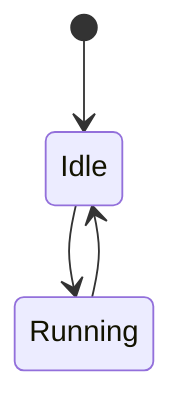

# Diagrams

Visual documentation: architecture diagrams, state machines, and data-flow
diagrams for MES Runner.

## Purpose

- Give a shared visual model of how the system fits together.
- Illustrate the moving parts that are hard to convey in prose — component
  boundaries, state transitions, and how data flows between processes.
- Support [RFCs](../rfcs/) and [decisions](../decisions/), which link to
  diagrams here rather than embedding large source blocks inline.

## Preferred format

Author diagrams in [**Mermaid**](https://mermaid.js.org/) inside Markdown files
wherever possible. Mermaid is text-based, so it diffs cleanly in review, renders
natively on most Git hosts, and lives alongside the code it describes.



Use binary formats (`.png`, `.svg`, `.excalidraw`) only when a diagram cannot be
reasonably expressed in Mermaid. When you do, commit the editable source
alongside the exported image.

## Suggested contents

- **Architecture** — process/module boundaries and their relationships.
- **State machines** — automation and application lifecycle states.
- **Data flow** — how data moves between the browser, automation engine, and UI.

## Lifecycle

Diagrams are **living documents** — unlike RFCs and decisions, they are updated
in place to stay in sync with the current system. A diagram that documents a
specific accepted design should note the RFC or decision it reflects, so a
reader can tell "current state" diagrams from "as-decided" ones.

## Naming convention

```
kebab-case-name.md       e.g. automation-state-machine.md
```

## Related

- [`../rfcs/`](../rfcs/) — proposals that reference these diagrams.
- [`../decisions/`](../decisions/) — decisions these diagrams illustrate.
